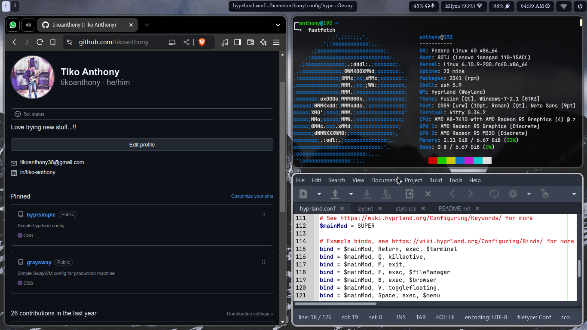
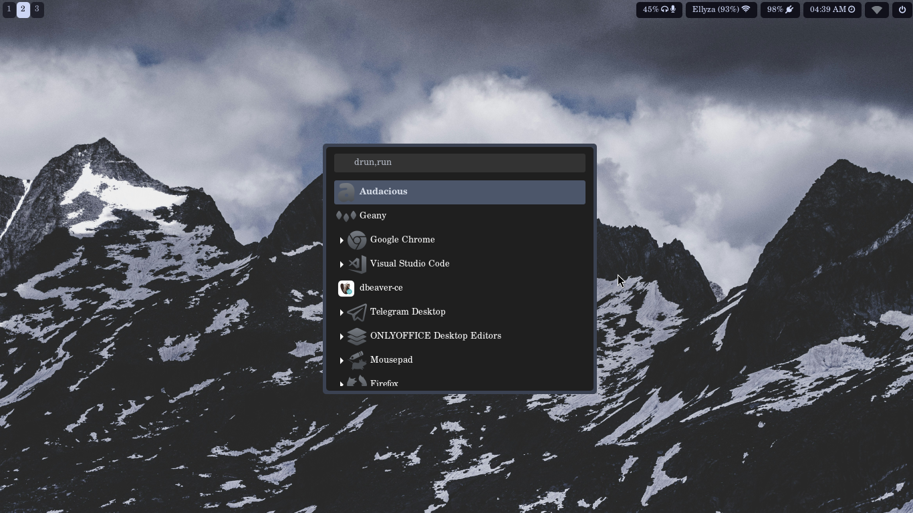

# hyprsimple
Simple hyprland config

PREVIEW:



Important: always back up your data before doing anything :D

Required packages:
```
hyprland hyprpaper waybar wofi wlogout kitty brightnessctl \ 
fonts-font-awesome grim thunar pavucontrol nm-applet
```

Also, maybe you will need this for dark theme 
1. [Icon Theme](https://www.gnome-look.org/p/2151189)
2. [Nordic Theme](https://github.com/EliverLara/Nordic)


Installing:
1. Copy default hypr, waybar, and wofi folder in your .config to template
2. If in your .config didn't have that folder, then
3. Copy the hypr, waybar, wofi, and kitty folder to .config
4. Restart hyprland

There you go.
